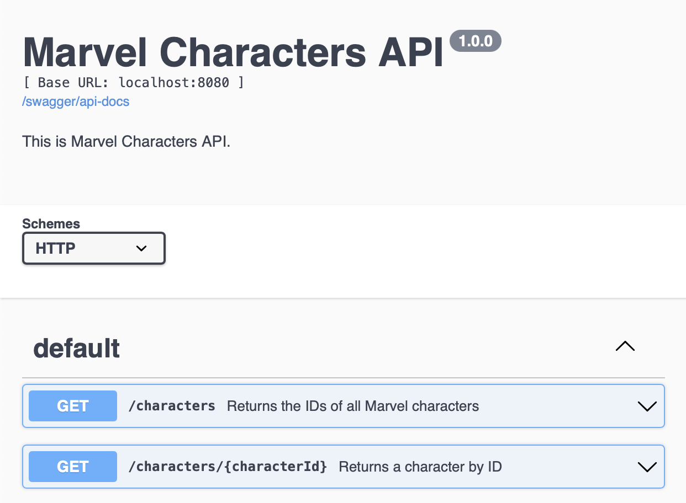
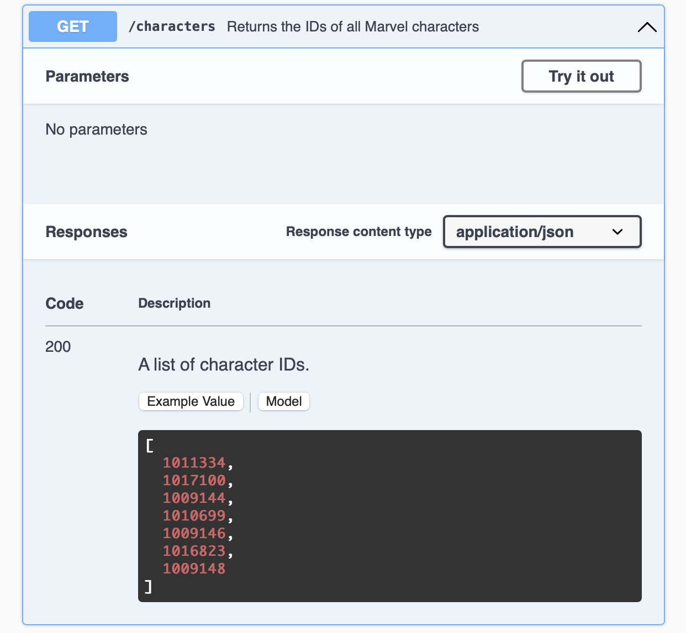
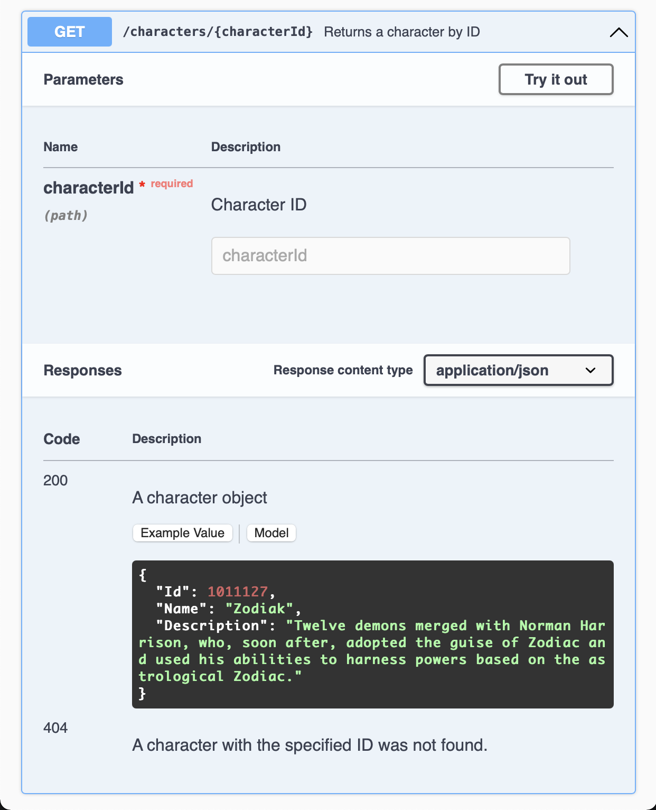

# Marvel Characters API


## Getting Started

Create `config.json`
```sh
$ cp config.json.example config.json
```

Modify the configurations in `config.json`

Install dependencies
```sh
$ npm install
```

Start API server
```sh
$ npm start
```


## Usage

### Swagger UI








Examples:

```sh
$ curl -i http://localhost:8080/characters

HTTP/1.1 200 OK
Content-Type: application/json; charset=utf-8
Content-Length: 15591
Date: Fri, 24 Sep 2021 16:45:17 GMT
Connection: keep-alive
Keep-Alive: timeout=5

[1011334,1017100,1009144,1010699,1009146,1016823,1009148,...]
```

```sh
$ curl -i http://localhost:8080/characters/1011127

HTTP/1.1 200 OK
Content-Type: application/json; charset=utf-8
Content-Length: 209
Date: Fri, 24 Sep 2021 16:51:26 GMT
Connection: keep-alive
Keep-Alive: timeout=5

{"Id":1011127,"Name":"Zodiak","Description":"Twelve demons merged with Norman Harrison, who, soon after, adopted the guise of Zodiac and used his abilities to harness powers based on the astrological Zodiac."}
```

```sh
$ curl -i http://localhost:8080/characters/1

HTTP/1.1 404 Not Found
Content-Type: text/plain; charset=utf-8
Content-Length: 9
Date: Fri, 24 Sep 2021 16:52:52 GMT
Connection: keep-alive
Keep-Alive: timeout=5

Not Found
```


## Development

To run test
```sh
$ npm test
```


## References

* [Setting up Jest with ESM](https://gist.github.com/rstacruz/511f43265de4939f6ca729a3df7b001c)
* [Mocking a Database in Node with Jest](https://www.youtube.com/watch?v=IDjF6-s1hGk&t=473s)
* [lowdb](https://github.com/typicode/lowdb)
* [Setting up Swagger with a Koa API](https://ljn.io/posts/swagger-for-a-koa-api)
